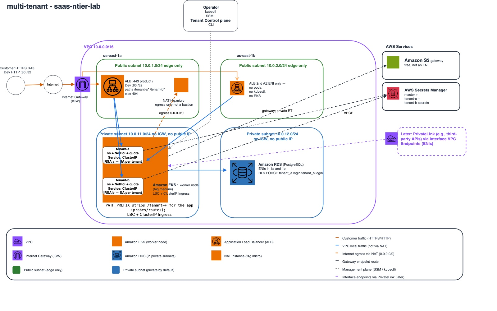

# saas-ntier-lab

Cheap AWS **n-tier lab** with a **SaaS shape**: one shared platform (VPC, EKS, ALB), not one stack per customer. Destroy paid compute after a test. Keep the free network.

This is a personal lab / resume reference, not a production SaaS product. Pooled tenants (two namespaces, one RDS, NetworkPolicy) are in the Helm chart. HTTPS and PrivateLink are still [What’s next](#whats-next).

## Architecture



**Private by default:** EKS nodes and RDS ENIs have **no public IPs** and **no IGW** on their route tables. The only IGW is on the **left edge**, for two Dev exceptions: (1) self-serve customer traffic to the public ALB, (2) NAT egress so nodes can pull images.

**Customer path:** product edge is **HTTPS :443** on the ALB (ACM). Dev is **HTTP :80** locked to your `/32` because there is no domain or certificate yet. ALB→node is still VPC HTTP to NodePort **30080** (TLS terminates at the ALB). Do not send customer traffic through NAT.

**Why NodePort 30080:** the ALB is Terraform-managed with **instance targets** (the EKS node’s private IP). There is no AWS Load Balancer Controller (it would not fit on a single `t4g.small`). Helm exposes the app as NodePort **30080**; the ALB health-checks that port. 30080 is a fixed high port (not 80, which needs extra privileges). Inside the cluster this is still a normal Service → pod; NodePort is only the ALB’s hook onto the node.

**NAT (Dev egress only):** private nodes → NAT → IGW for image pulls and APIs we did not endpoint yet. Later: interface VPCEs and/or PrivateLink, then NAT can go away.

**Operator path (you):** kubectl to the EKS API. **SSM to the EKS worker node** for debug that kubectl cannot do (kubelet, CNI, disk). That is not a bastion and not a path to other subnets. NAT has SSM only so you can repair iptables on the NAT box itself — it is not drawn as an access path.

**Why us-east-1b looks empty:** AWS will not create an ALB (or an RDS subnet group) in one AZ. Compute stays in **1a** (one NAT, one node). **1b** has empty public and private subnets so the ALB can place an ENI in a second AZ, and so RDS can use two private subnets when you set `enable_rds`. Subnets are free; you are not paying for a second node.

Private subnets egress via the NAT instance; S3 uses a **gateway** endpoint (no NAT).

**RDS vs S3/SNS:** RDS is an AWS-managed engine, but the instance still has **ENIs in your private subnets** and a security group (pods reach it on 5432 inside the VPC). S3, SNS, and CloudWatch are regional APIs — they sit outside the VPC. The diagram puts RDS with the other managed icons; the dashed line back into **1a/1b private subnets** is the network attachment. Off by default (`enable_rds`).

**Pooled tenants (same platform):** two namespaces (`tenant-a`, `tenant-b`), one Postgres, `tenant_id` on every row. The tenant is a **Helm value** (`TENANT_ID` on the pod), not a client header. NetworkPolicy plus the VPC CNI addon (`enableNetworkPolicy`) blocks B→A in-cluster. The public ALB still has **one** NodePort (**30080**), so only tenant A is on the internet URL; tenant B is ClusterIP (port-forward or in-cluster). That is pooled SaaS, not a VPC per customer.

Keep the VPC. Destroy NAT, EKS, ALB, and RDS after a test. Diagram: [architecture.jpg](architecture.jpg). Vector source kept for later: [architecture.svg](architecture.svg). Draw.io: [architecture.mmd](architecture.mmd).

## What’s next

Same shared platform. No rewrite.

1. **Both tenants on the ALB** — second NodePort or path/host rules so B is not port-forward-only.
2. **HTTPS on the ALB** — ACM on a domain you **own**. A Route 53 private zone does not get a public cert and does not resolve from your laptop.
3. **PrivateLink provider** — enterprise customers attach privately; they never use the IGW.
4. **Shrink NAT** — interface VPC endpoints for ECR/EKS/SSM APIs so private nodes do not need internet egress; then NAT can go.

Editable source and this list stay honest: HTTPS/PrivateLink boxes are dashed on the diagram until they exist.

## Terraform

The HCL is standard Terraform. Examples use **OpenTofu** (`tofu`) because that is what this lab is tested with. HashiCorp **Terraform** (`terraform`) uses the same commands and the same files.

```bash
# either works; this repo is validated with OpenTofu 1.12
tofu version    # or: terraform version
```

Do **not** apply from the repo root. Apply from a stack directory (`env/dev/network` or `env/dev/workload`).

## Layout

```
bootstrap/          # Optional S3 + DynamoDB + KMS for remote state (~$1/month)
modules/            # VPC, NAT instance, EKS, RDS, ALB
env/dev/network/    # Keep: VPC, subnets, IGW, S3 gateway endpoint
env/dev/workload/   # Destroy after tests: NAT, EKS, ALB, optional RDS
helm/test-app/      # App chart (NodePort 30080; values-tenant-a / values-tenant-b)
```

Dev uses **SSM Session Manager on the EKS node** for host debug, not a public SSH bastion. NAT is egress only.

## Dev cost habit

| Keep overnight | Destroy after a test |
|----------------|----------------------|
| VPC, subnets, route tables, IGW, S3 **gateway** endpoint | NAT instance, public IPv4, EKS, ALB, RDS |
| Bootstrap state bucket / lock table / KMS (~$1/month) | Interface VPC endpoints (not used in Dev) |

EKS has **no create fee**. The control plane is **$0.10/hour** (~$73/month) while the cluster exists, including the ~15 minutes AWS spends creating it. Dev pins Kubernetes **1.35** (standard support). Extended-support versions are **$0.60/hour**. Destroy `env/dev/workload` when you stop; do not leave EKS overnight.

## Prerequisites

- OpenTofu >= 1.6 **or** Terraform >= 1.6
- AWS CLI v2 (`aws sts get-caller-identity`)
- kubectl and Helm 3+ (when you reach EKS)
- Session Manager plugin (`brew install --cask session-manager-plugin`) for SSM

## Apply

Do **not** commit `.tfstate`, real bucket names, or `terraform.tfvars`. Pass your public IP on the CLI.

```bash
# 1) Optional remote state (once per account). Laptop can stay on local state.
cd bootstrap
cp terraform.tfvars.example terraform.tfvars
# set a globally unique state_bucket_name (yours, not committed)
tofu init && tofu apply
# then uncomment backend.tf in env/dev/network and env/dev/workload
# tofu init -migrate-state in each stack

# 2) Network. Leave applied.
cd env/dev/network
cp terraform.tfvars.example terraform.tfvars
tofu init
tofu apply -var-file=terraform.tfvars

# 3) Workload (NAT + EKS + ALB). RDS is off until you set enable_rds = true.
cd ../workload
cp terraform.tfvars.example terraform.tfvars
tofu apply -var-file=terraform.tfvars \
  -var="my_ip=$(curl -s https://checkip.amazonaws.com)/32"
# ~15 min, then:
aws eks update-kubeconfig --name ntier-dev-eks-cluster --region us-east-1
kubectl get nodes
tofu output -raw helm_install   # copy, run; then:
curl -s "$(tofu output -raw alb_url)/health"
tofu destroy -var-file=terraform.tfvars \
  -var="my_ip=$(curl -s https://checkip.amazonaws.com)/32"
```

If you omit `-var`, you are prompted for `my_ip`. Use `x.x.x.x/32`. Keep `env/dev/network` applied.

Default workload: NAT instance, one On-Demand `t4g.small` node, HTTP ALB (your `/32` only), S3 access logs, SNS 5xx alarm. **RDS is off.** No port-forward — `curl http://<alb_dns>/health`.

To add Postgres, set `enable_rds = true` in `terraform.tfvars`, apply again (same `my_ip` `-var`), then re-run `tofu output -raw helm_install`. That one flag creates the instance, secret, and IRSA. Apply also creates the **vpc-cni** EKS addon with NetworkPolicy enabled (the CNI DaemonSet is already there; `aws eks list-addons` is empty until this resource exists — do not `tofu import` it).

`tofu output -raw helm_install` installs **one** release in `default` (`tenant.id=lab`). For the two-tenant proof, uninstall that and use [Pooled tenants](#pooled-tenants).

## Pooled tenants

Same EKS and RDS. IRSA trust includes `system:serviceaccount:tenant-a:test-app` and `tenant-b:test-app`.

From `env/dev/workload` after RDS is up and the node is Ready:

```bash
NODE_IP=$(kubectl get nodes -o jsonpath='{.items[0].status.addresses[?(@.type=="InternalIP")].address}')
IRSA=$(tofu output -raw test_app_irsa_role_arn)
HOST=$(tofu output -raw rds_endpoint | cut -d: -f1)
SECRET=$(tofu output -raw rds_secret_name)
CHART=./../../../helm/test-app
ANN="{\"eks.amazonaws.com/role-arn\":\"${IRSA}\"}"

helm uninstall test-app -n default || true
kubectl create namespace tenant-a --dry-run=client -o yaml | kubectl apply -f -
kubectl create namespace tenant-b --dry-run=client -o yaml | kubectl apply -f -

helm upgrade --install test-app "$CHART" -n tenant-a -f "$CHART/values-tenant-a.yaml" \
  --set-json "serviceAccount.annotations=${ANN}" \
  --set database.enabled=true --set database.host="$HOST" --set database.secretName="$SECRET" \
  --set region=us-east-1 --set "networkPolicy.ingressCidrs={${NODE_IP}/32}"

helm upgrade --install test-app "$CHART" -n tenant-b -f "$CHART/values-tenant-b.yaml" \
  --set-json "serviceAccount.annotations=${ANN}" \
  --set database.enabled=true --set database.host="$HOST" --set database.secretName="$SECRET" \
  --set region=us-east-1 --set "networkPolicy.ingressCidrs={${NODE_IP}/32}"

kubectl -n tenant-a rollout status deploy/test-app --timeout=300s
kubectl -n tenant-b rollout status deploy/test-app --timeout=300s
```

`ingressCidrs` is the **node** `/32` (kubelet probes and NodePort SNAT). Pod-to-pod uses the pod IP, so B is not allowed into A.

### What we validated

| Check | Command | Pass |
|--------|---------|------|
| A is on the ALB | `curl -s "$(tofu output -raw alb_url)/health"` | `"tenant_id":"a"`, `"database":"connected"` |
| A writes/reads only A | `POST /db/items` then `GET /db/records` on the ALB | rows with `"tenant_id":"a"` only |
| B is not on the ALB | `kubectl -n tenant-b port-forward svc/test-app 18080:8080` | `/health` → `"tenant_id":"b"` |
| B writes/reads only B | `POST` / `GET` on `127.0.0.1:18080` | rows with `"tenant_id":"b"` only (e.g. ids 3–4 vs A’s id 2) |
| A cannot be called from B | `kubectl run netcheck -n tenant-b --rm -it --image=busybox --restart=Never -- wget -qO- --timeout=3 http://test-app.tenant-a.svc.cluster.local:8080/health` | `wget: download timed out` |
| Client cannot pick the tenant | ALB `?tenant_id=b` or `X-Tenant-Id: b` | still A’s rows — tenant comes from Helm, not the request |

Confirm the CNI addon before the wget test (`aws-node` **2/2** is the policy sidecar):

```bash
aws eks describe-addon --cluster-name ntier-dev-eks-cluster --addon-name vpc-cni --region us-east-1 \
  --query 'addon.{status:status,config:configurationValues}' --output json
```

Status must be `ACTIVE` and config must include `enableNetworkPolicy`. Query `addon.status` — a top-level `status` in JMESPath is always null.

## License

Apache 2.0. See [LICENSE](LICENSE).
