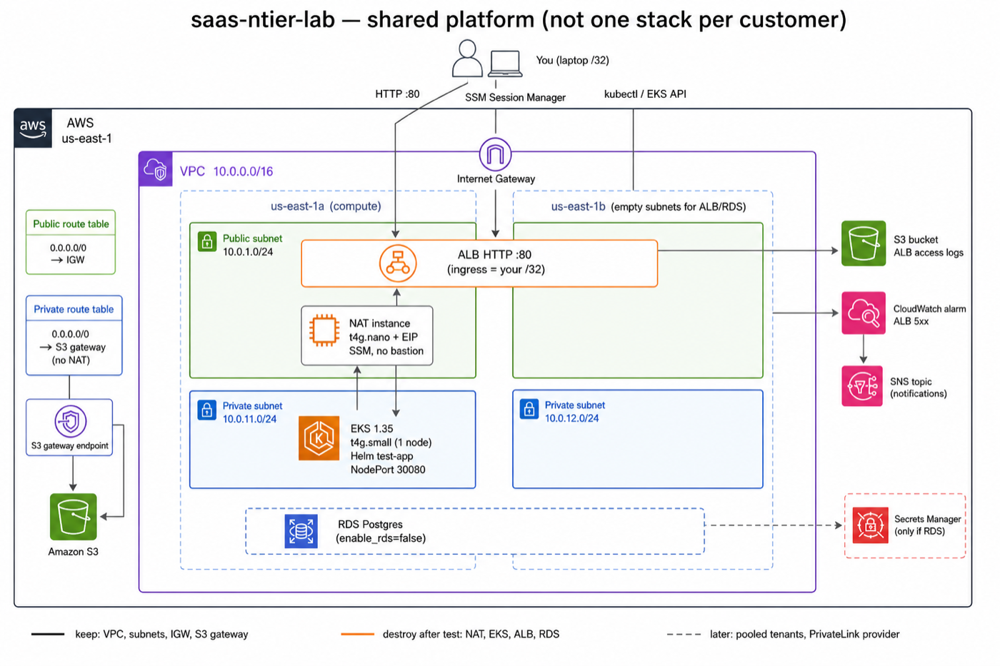

# saas-ntier-lab

Cheap AWS **n-tier lab** with a **SaaS shape**: one shared platform (VPC, EKS, ALB), not one stack per customer. Destroy paid compute after a test. Keep the free network.

This is a personal lab / resume reference, not a production SaaS product. Pooled tenants (namespaces) and a PrivateLink front door for enterprise customers are the intended next steps, not this snapshot.

## Architecture



Laptop `/32` → HTTP ALB, SSM to the NAT instance, kubectl to the EKS API. ALB forwards to Helm on NodePort **30080**. Private subnets egress via the NAT instance; S3 uses a **gateway** endpoint (no NAT). RDS is dashed — `enable_rds` is off by default.

Keep the VPC. Destroy NAT, EKS, ALB, and RDS after a test. Editable source: [architecture.mmd](architecture.mmd) (paste into draw.io: Arrange → Insert → Advanced → Mermaid).

## Terraform

The HCL is standard Terraform. Examples use **OpenTofu** (`tofu`) because that is what this lab is tested with. HashiCorp **Terraform** (`terraform`) uses the same commands and the same files.

```bash
# either works; this repo is validated with OpenTofu 1.12
tofu version    # or: terraform version
```

Do **not** apply from the repo root. Apply from a stack directory (`env/dev/network` or `env/dev/workload`).

## Layout

```
bootstrap/          # Optional S3 + DynamoDB + KMS for remote state (~$1/month)
modules/            # VPC, NAT instance, EKS, RDS, ALB
env/dev/network/    # Keep: VPC, subnets, IGW, S3 gateway endpoint
env/dev/workload/   # Destroy after tests: NAT, EKS, ALB, optional RDS
helm/test-app/      # App chart (NodePort 30080 behind the ALB)
```

Dev uses **SSM Session Manager** on the NAT instance, not a public SSH bastion.

## SaaS angle (honest)

| Today | Later, same repo |
|--------|------------------|
| Shared VPC + EKS + public HTTP ALB (your `/32`) | Same ALB as the self-serve edge (`0.0.0.0/0` + TLS/WAF) |
| One app, RDS off by default (`enable_rds`) | Two namespaces / tenant key on the same cluster |
| — | PrivateLink **provider** so an enterprise VPC attaches privately |

The uncommon part is “customers attach to **your** platform,” not a longer list of AWS services.

## Dev cost habit

| Keep overnight | Destroy after a test |
|----------------|----------------------|
| VPC, subnets, route tables, IGW, S3 **gateway** endpoint | NAT instance, public IPv4, EKS, ALB, RDS |
| Bootstrap state bucket / lock table / KMS (~$1/month) | Interface VPC endpoints (not used in Dev) |

EKS has **no create fee**. The control plane is **$0.10/hour** (~$73/month) while the cluster exists, including the ~15 minutes AWS spends creating it. Dev pins Kubernetes **1.35** (standard support). Extended-support versions are **$0.60/hour**. Destroy `env/dev/workload` when you stop; do not leave EKS overnight.

## Prerequisites

- OpenTofu >= 1.6 **or** Terraform >= 1.6
- AWS CLI v2 (`aws sts get-caller-identity`)
- kubectl and Helm 3+ (when you reach EKS)
- Session Manager plugin (`brew install --cask session-manager-plugin`) for SSM

## Apply

Do **not** commit `.tfstate`, real bucket names, or `terraform.tfvars`. Pass your public IP on the CLI.

```bash
# 1) Optional remote state (once per account). Laptop can stay on local state.
cd bootstrap
cp terraform.tfvars.example terraform.tfvars
# set a globally unique state_bucket_name (yours, not committed)
tofu init && tofu apply
# then uncomment backend.tf in env/dev/network and env/dev/workload
# tofu init -migrate-state in each stack

# 2) Network. Leave applied.
cd env/dev/network
cp terraform.tfvars.example terraform.tfvars
tofu init
tofu apply -var-file=terraform.tfvars

# 3) Workload (NAT + EKS + ALB). RDS is off until you set enable_rds = true.
cd ../workload
cp terraform.tfvars.example terraform.tfvars
tofu apply -var-file=terraform.tfvars \
  -var="my_ip=$(curl -s https://checkip.amazonaws.com)/32"
# ~15 min, then:
aws eks update-kubeconfig --name ntier-dev-eks-cluster --region us-east-1
kubectl get nodes
tofu output -raw helm_install   # copy, run; then:
curl -s "$(tofu output -raw alb_url)/health"
tofu destroy -var-file=terraform.tfvars \
  -var="my_ip=$(curl -s https://checkip.amazonaws.com)/32"
```

If you omit `-var`, you are prompted for `my_ip`. Use `x.x.x.x/32`. Keep `env/dev/network` applied.

Default workload: NAT instance, one On-Demand `t4g.small` node, HTTP ALB (your `/32` only), S3 access logs, SNS 5xx alarm. **RDS is off.** No port-forward — `curl http://<alb_dns>/health`.

To add Postgres, set `enable_rds = true` in `terraform.tfvars`, apply again (same `my_ip` `-var`), then re-run `tofu output -raw helm_install`. That one flag creates the instance, secret, and IRSA.

## License

Apache 2.0. See [LICENSE](LICENSE).
